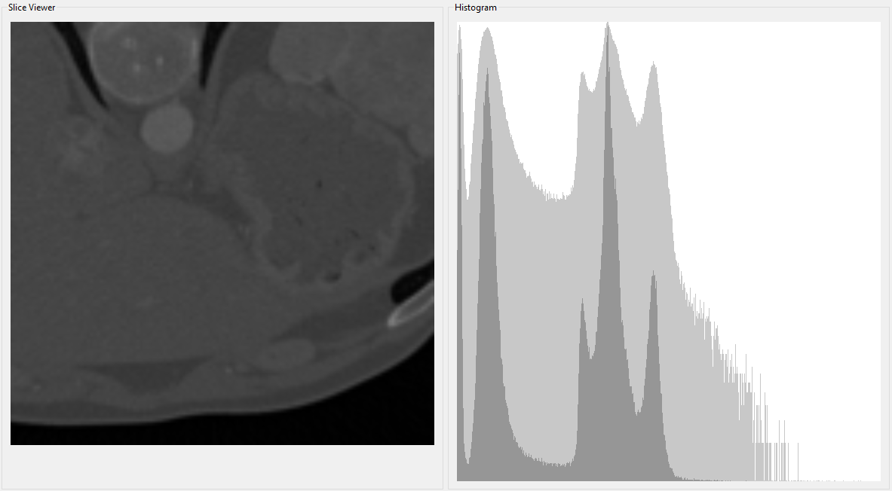

# Medical Visualization

This repository contains a collection of medical visualization techniques developed as part of the Simulation and Data Visualization course. Each project demonstrates a practical implementation using the Qt framework.

### Features

- **Volume Renderer**: Visualizes volumetric CT scan data using ray marching techniques.
- **Slice Viewer**: Displays a 2D cross-sections of 3D CT scan data.
- **Pandemic Simulation**: Simulates and visualizes the spread of infectious diseases over time.
- **Voronoi Fracture**: Generates Voronoi diagrams to simulate spatial partitioning.


## Getting Started

To build and run the projects:

1. Install [Qt](https://www.qt.io/download-dev) (Version `6.9.0`) and ensure the **Qt Charts** module is included.

3. Clone this repository:
   ```bash
   git clone https://github.com/chFleschutz/medical-visualization.git
   ```

4. Open the folder in Visual Studio.

5. Build and run the project.


## Screenshots

### Volume Renderer

<div style="display: flex; justify-content: center;">
   
   
</div>

### Slice Viewer

<div style="display: flex; justify-content: center;">
   
</div>

### Pandemic Simulation

<div style="display: flex; justify-content: center;">
   
</div>


### Voronoi Fracture

<div style="display: flex; justify-content: center;">
   
   
</div>

